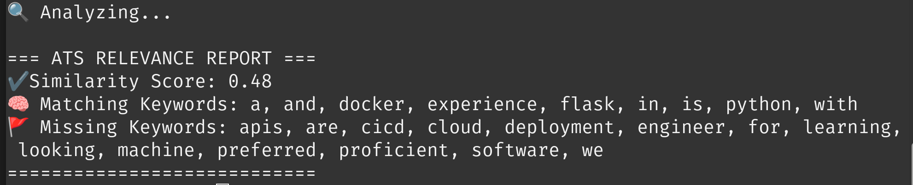

# 🧾 ats-helper

A lean, local-first tool to **analyze and score CVs against job descriptions**, designed to help recruiters or jobseekers understand ATS relevance quickly.

- 📂 Upload any `.txt`, `.pdf`, or `.docx` resume
- 💼 Compare against one or more job descriptions
- 🤖 See keyword matches, similarity scores, and red flags
- 🧠 Powered by spaCy and simple NLP (no OpenAI/LLM dependency)
- ✅ Local, fast, no data leaves your machine

> Built by Giuseppe to solve real recruiter problems. Fast. Simple. Helpful.

---

## 🚀 Quickstart

Clone and install:

```bash
git clone https://github.com/Giuseppe552/ats-helper.git
cd ats-helper
pip install -r requirements.txt
````

Then run:

```bash
python main.py
```

---

## 🛠 Example Use Case

```bash
python main.py \
  --cv resume_giuseppe.pdf \
  --job jd_software_engineer.txt
```

Outputs a relevance report with:

* 🔍 Keyword match percentage
* 📉 Missing key terms
* 🧠 Simple similarity score
* ⛳ Suggestions to improve

---

<p align="center">
  
</p>

> ⚡️ One-liner demo:

```bash
bash -c 'git clone https://github.com/Giuseppe552/ats-helper.git && cd ats-helper && python3 -m venv venv && source venv/bin/activate && pip install -r requirements.txt && python main.py --cv sample_data/resume_giuseppe.txt --job sample_data/jd_software_engineer.txt'


## 📁 Folder Structure

```
ats-helper/
├── main.py
├── utils.py
├── requirements.txt
├── sample_data/
│   ├── resume_giuseppe.pdf
│   └── jd_software_engineer.txt
└── README.md
```

---

## ⚖️ License

MIT — free to use, fork, or adapt. If it helps, star it ⭐

---

Built for recruiters, job hunters, and hiring teams who just want **fast answers**.

````

